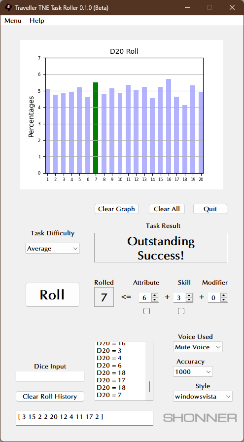
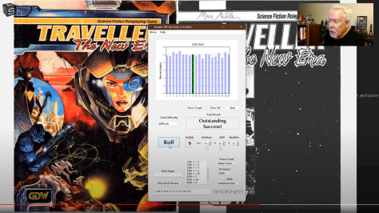
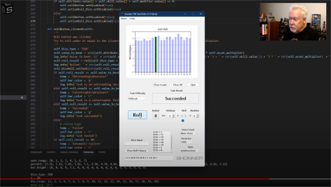

**Traveller TNE Task Roller for Python 3.11**
=============================================

**Traveller TNE Task Roller** is a Python 3.11 program for rolling various dice using PyQt5 and Matplotlib.

Some Things Required
--------------------

* **Windows 11**

  This code will still run on Windows 10.

* **Python 3.11**

  This code was written using Python 3.11.6.

* **PyQt5 5.15.9**

  PyQt5 is the framework used for displaying the Window GUI and buttons, etc.
   
* **numpy 1.26.0**

  For building arrays.

* **matplotlib 3.8.0**

  For graphics plotting.

* **pyttsx3 2.90**

  For the MS Zira and MS David voices (it will try to detect other SAPI voices installed).
  
* **Fonts**

  Simply install the fonts found in the fonts folder.

What's in v0.1.0?
-----------------

Don't Have Python?
------------------

The .EXE version can be run in Windows 11 and 10.

.. |ss| raw:: html

    <strike>

.. |se| raw:: html

    </strike>

Things To-Do
------------

| Instruction manual.
| Cheat codes.
|ss|

| Start on a To-Do.

|se|

**Known History**

* v0.1.0b

  Initial release.

Contact
-------
Questions? Please contact shawndriscoll@hotmail.com
